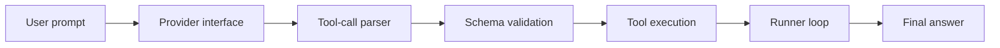

# Architecture Pack

## System Boundary

This repository provides a small Go runtime for deterministic agent execution. It is intentionally narrow: a provider produces candidate messages, the runner validates and executes allowed tools, and the loop stops on a final answer or configured limit.

## Architecture Notes



The important boundary is the `runtime.Provider` interface. It allows local tests, custom endpoints, or live providers without changing runner logic.

## Demo Path

```bash
go test ./...
go run ./cmd/bench-runner -h
```

Useful entry points:

- `runtime/runner.go`
- `runtime/validate.go`
- `runtime/retry.go`
- `providers/openai/openai.go`
- `tests/runner_test.go`

## Validation Evidence

- Runner tests cover step limits, tool execution, validation, and deterministic provider behavior.
- Lint-sensitive close handling is explicit in provider and fixture code.
- The runtime has no generated code and keeps the public interfaces small.

## Threat Model

| Risk | Control |
|---|---|
| Tool hallucination | tool name lookup and schema validation |
| Infinite loop | max-step limit |
| Provider failure | retry and typed error path |
| Resource leak | explicit body and file close handling |

## Maintenance Notes

- Keep provider adapters thin.
- Add tests at the runner boundary before expanding tool semantics.
- Avoid global mutable state in runtime code.
- Keep examples deterministic by default.
